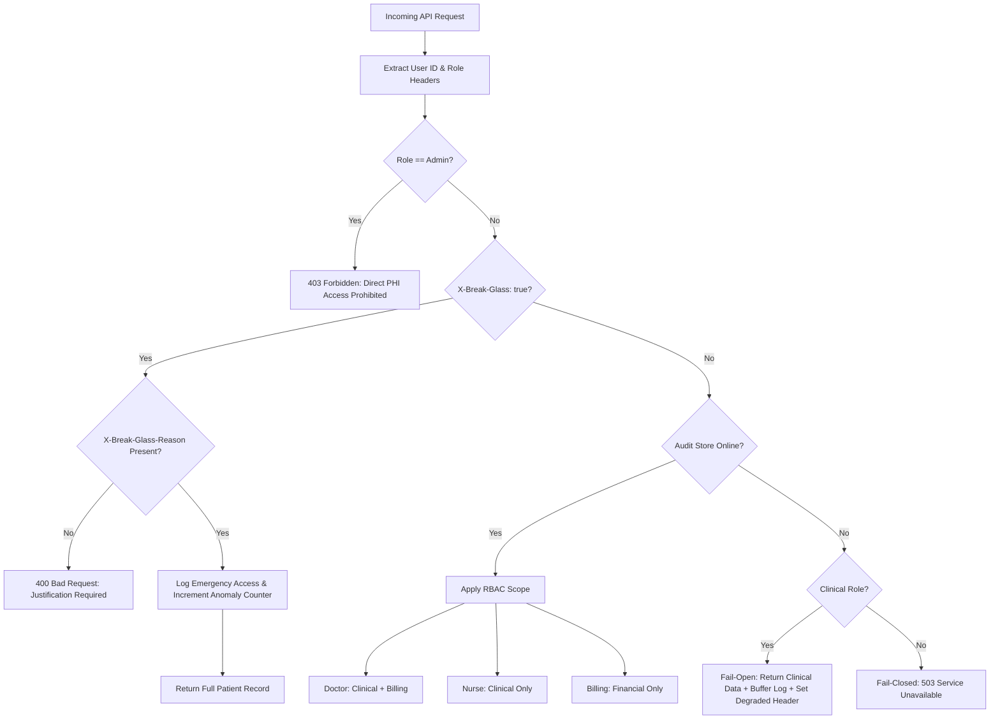

# access-sentinel

`access-sentinel` is a simulated patient-records access system exploring how healthcare software balances strict Role-Based Access Control (RBAC) with high system availability during emergency scenarios and downstream audit log outages.

> **Disclaimer:** This repository is a personal learning project modeling architectural access control and resilience patterns used in healthcare systems. It is **not** a production-ready application and **must not** be described or used as HIPAA-compliant software.

---

## Architecture & Data Flow



---

## System Features

- **API-Enforced Role-Based Access Control:** Scopes record fields based on context (`doctor`, `nurse`, `billing`, `admin`).
- **Cryptographic Audit Log Chain:** Append-only log entries chained with SHA-256 parent hashes (`prev_hash`). Direct edits or deletions return `405 Method Not Allowed`.
- **Break-Glass Emergency Access:** Clinicians can override standard scoping in declared emergencies with mandatory justification logging.
- **Graceful Degradation:** Dual-mode strategy during audit store outages — fail-open for clinical reads, fail-closed for non-clinical access.
- **Observability Telemetry:** Prometheus metrics (`/metrics`) and Grafana dashboards tracking access patterns and break-glass anomalies.

---

## Setup & Running Locally

### Requirements

- Python 3.11+
- Docker & Docker Compose
- PostgreSQL (or run via Docker Compose, see below)

### 1. Clone and Install

```bash
git clone https://github.com/aashiruu/access-sentinel.git
cd access-sentinel

# Create and activate virtual environment
python3 -m venv .venv
source .venv/bin/activate

# Install dependencies
pip install -r requirements.txt
```

### 2. Configure Environment

```bash
cp .env.example .env
# Edit .env with your database connection string
```

### 3. Run the Database and Observability Stack

```bash
docker compose up -d
```

This starts PostgreSQL, Prometheus, and Grafana.

- **Grafana:** `http://localhost:3000` (Credentials: `admin` / `admin`)
- **Prometheus:** `http://localhost:9090`

### 4. Run the API Server

```bash
uvicorn app.main:app --host 0.0.0.0 --port 8000
```

---

## Quick Verification

```bash
# Doctor requesting a patient record (should succeed, clinical + billing scope)
curl -H "X-User-Role: doctor" http://localhost:8000/patients/123

# Billing role attempting clinical data (should be denied/scoped)
curl -H "X-User-Role: billing" http://localhost:8000/patients/123

# Break-glass access without justification (should return 400)
curl -H "X-User-Role: doctor" -H "X-Break-Glass: true" http://localhost:8000/patients/123
```

See `docs/verification.md` for full traces, including audit log tamper-rejection and degraded-mode behavior.

---

## Documentation

- [`docs/tradeoffs.md`](docs/tradeoffs.md) — architectural design decisions and stage-by-stage trade-off analysis
- [`docs/verification.md`](docs/verification.md) — real terminal execution traces and verification logs
