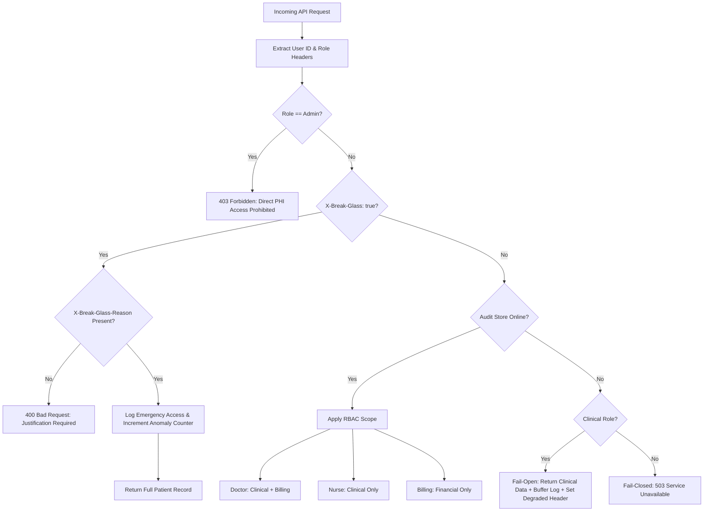

# access-sentinel

`access-sentinel` is a simulated patient-records access system exploring how healthcare software balances strict Role-Based Access Control (RBAC) with high system availability during emergency scenarios and downstream audit log outages.

> **Disclaimer:** This repository is a personal learning project modeling architectural access control and resilience patterns used in healthcare systems. It is **not** a production-ready application and **must not** be described or used as HIPAA-compliant software.

---

## Architecture & Data Flow



## System Features
- **API-Enforced Role-Based Access Control**: Scopes record fields based on context (`doctor`, `nurse`, `billing`, `admin`).

- **Cryptographic Audit Log Chain**: Append-only log entries chained with SHA-256 parent hashes (`prev_hash`). Direct edits or deletions return `405 Method Not Allowed`.

- **Break-Glass Emergency Access**: Clinicians can override standard scoping in declared emergencies with mandatory justification logging.

- **Graceful Degradation**: Dual-mode strategy during audit store outages, Fail-Open for clinical reads, Fail-Closed for non-clinical access.

- **Observability Telemetry**: Prometheus metrics (`/metrics`) and Grafana visual dashboards tracking access patterns and break-glass anomalies.

## Setup & Running Locally

### 1. Requirements & Installation

# Clone repository
```
git clone [https://github.com/aashiruu/access-sentinel.git](https://github.com/aashiruu/access-sentinel.git)
```
```
cd access-sentinel
```

# Create and activate virtual environment
```
python3 -m venv .venv
```
```
source .venv/bin/activate
```

# Install dependencies
```
pip install -r requirements.txt
```
### 2. Run API Server
```
uvicorn app.main:app --host 0.0.0.0 --port 8000
```
### 3. Run Observability Stack (Prometheus + Grafana)
```
docker compose up -d
```

- **Grafana**: `http://localhost:3000` (Credentials: `admin` / `admin`)

- **Prometheus**: `http://localhost:9090`

## Documentation
- docs/tradeoffs.md : Architectural design decisions and stage-by-stage trade-off analysis.

- docs/verification.md : Real terminal execution traces and verification logs.
